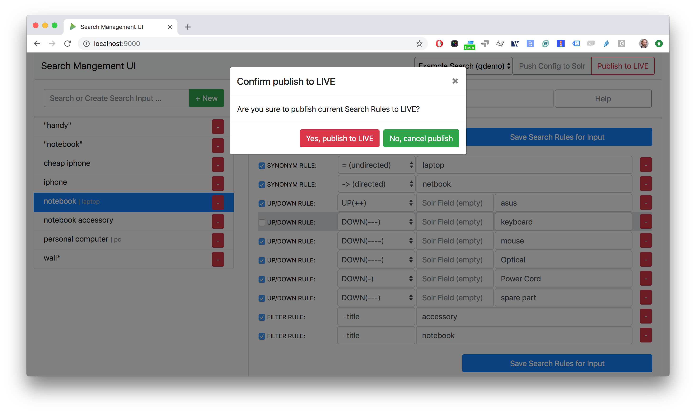

[](https://travis-ci.org/pbartusch/smui)

# Search Management UI (SMUI)



SMUI is a tool for managing Solr-based onsite search. It provides a web user interface for maintaining rules for query rewriting based on the Querqy Solr plugin for query rewriting. Please see [querqy](https://github.com/renekrie/querqy) for the installation of Querqy.

## Major changes in v3 (compared to v2)

* Auto-DECORATE do not exist any more. Please migrate any usage to Auto-Log-Rule-ID
* SMUI for that feature depends now on v3.3 of [querqy](https://github.com/renekrie/querqy)

## Major changes in v2 (compared to v1)

* Database schema definition (SQL) implemented more lightweight, so that SMUI can be operated with every standard SQL database (entity IDs therefore needed to be adjusted, see "Migrate pre-v2 SMUI databases" for details)

## INSTALLATION

### Step 1: Install SMUI application (recommended: using docker image or Docker Hub repository)

#### Build and start as a docker container

You can use `make` to build and run SMUI as or into a docker container (see [Makefile](Makefile)), e.g. (command line):

```
make docker-build
make docker-run
```

#### Use SMUI docker image from Docker Hub

SMUI is also integrated into a Travis CI build pipeline, that provides a Docker Hub SMUI image. You can pull the latest SMUI (master branch) from its public Docker Hub repository (command line):

```
docker pull pbartusch/smui:latest
```

### Step 1 / alternative (deprecated): Install SMUI from an RPM image

This section describes, how to install SMUI from an RPM image.
Example script (command line):

```
rpm -i PATH/search-management-ui-VERSION.noarch.rpm
```

Note:
* Ensure the user running the search-management-ui (e.g. `smui`) has read permission to the necessary files (e.g. binary JAR files) and write permission for logs, temp file as well as application's PID (see "Step 3").
* Ensure `search-management-ui` service is being included to your Server's start up sequence (e.g. `init.d`).
* It might be necessary to execute command with root rights.

WARNING: Installing SMUI from an RPM image is deprecated (as of sep/2019). Use a docker setup instead.

### Step 2: Create and configure database (SQL level)

Create SMUI database, user and assign according permissions. Example script (SQL, MariaDB / MySQL):

```
CREATE USER 'smui'@'localhost' IDENTIFIED BY 'smui';
CREATE DATABASE smui;
GRANT ALL PRIVILEGES ON smui.* TO 'smui'@'localhost' WITH GRANT OPTION;
```

Supported (tested) databases:

In principal SMUI database connection implementation is based on JDBC as well as only standard SQL is used, so technically every database management system supported by JDBC should be supported by SMUI as well. However as database management systems potentially come with specific features, SMUI explicity is tested (and/or productively used) only with the following database management systems:

* MySQL & MariaDB
* PostgreSQL
* SQLite
* HSQLDB

#### Migrate pre-v2 SMUI databases

As of version 2 of SMUI various database management systems are supported. With that, the database schema changed, IDs became UUIDs. To migrate pre-v2 SMUI databases (e.g. using a MySQL or MariaDB setup), those IDs especially need to be adjusted (contact the author for details).

### Step 3: Configure runtime and application

SMUI is configured passing environment variables to the docker container SMUI runs on. The following section describes all parameters, that you can configure SMUI with. Mappings of config keys to environment variables can be found in [application.conf](conf/application.conf) (e.g. `SMUI_DB_JDBC_DRIVER` environment variable sets `db.default.driver`).

Note: Environment variables are the preferred way to configure your production environment whereas using a local `smui-dev.conf` is recommended, when developing (see "DEVELOPMENT SETUP").

The following sections describe application configs in more detail.

##### Configure basic settings

The following settings can (and should) be overwritten on application.conf in your own `smui-prod.conf` level:

config key | description | default
--- | --- | ---
`db.default.driver` | JDBC database driver | MySQL database on localhost for smui:smui
`db.default.url` | Database host and optional connection parameters (JDBC connection string) | MySQL database on localhost for smui:smui
`db.default.username` `db.default.password` | Database credentials | MySQL database on localhost for smui:smui
`smui2solr.SRC_TMP_FILE` | Path to temp file (when rules.txt generation happens) | local /tmp file in docker container (recommended: leave default)
`smui2solr.DST_CP_FILE_TO` | Path to productive querqy rules.txt (within Solr context) | virtual local Solr instance (deprecated as of sep/2019 for production use)
`smui2solr.SOLR_HOST` | Solr host | virtual local Solr instance (deprecated as of sep/2019 for production use)
`play.http.secret.key` | Encryption key for server/client communication (Play 2.6 standard) | unsecure default

##### Configure Feature Toggle (application behaviour)

Optional. The following settings in the `application.conf` define its (frontend) behaviour:

config key | description | default
--- | --- | ---
`toggle.ui-concept.updown-rules.combined` | Show UP(+++) fields instead of separated rule and intensity fields. | `true`
`toggle.ui-concept.all-rules.with-solr-fields` | Offer a separated "Solr Field" input to the user (UP/DOWN, FILTER). | `true`
`toggle.rule-deployment.log-rule-id` | With every exported search input, add an additional @_log line that identifies the ID of the rule (if info logging in the search-engine / Solr for querqy is activated, see `querqy.infoLogging=on`, it is being communicated in the search-engine's / Solr response). | `false`
`toggle.rule-deployment.split-decompound-rule-txt` | Separate decompound synonyms (SOME* => SOME $1) into an own rules.txt file. WARNING: Activating this results in the need of having the second special-purpose-DST_CP_FILE_TO configured (see below). Temp file path for this purpose will be generated by adding a `-2` to `smui2solr.SRC_TMP_FILE`. | `false`
`toggle.rule-deployment.split-decompound-rule-txt-DST_CP_FILE_TO` | Path to productive querqy decompound-rules.txt (within Solr context). | ``
`toggle.rule-deployment.pre-live.present` | Make separated deployments pre-live vs. live possible (and display a button for that on the frontend). | `false`
`toggle.rule-deployment.custom-script` | If set to `true` the below custom script (path) is used for deploying the rules.txt files. | `false`
`toggle.rule-deployment.custom-script-SMUI2SOLR-SH_PATH` | Path to an optional custom script (see above). | ``
`toggle.rule-tagging` | Should tagging feature be activated. | `false`
`toggle.predefined-tags-file` | Path to optional file, that provides pre-defined rule tags (see "Configure predefined rule tags"). | ``
`smui.auth.ui-concept.simple-logout-button-target-url` | Target URL of simple logout button (see "Configure Authentication"). | ``

##### Configure predefined rule tags (optional)

Optional. You can define pre-defined rule tags, that can be used by the search manager to organise or even adjust the rules exported to the rules.txt. See [TestPredefinedTags.json](test/resources/TestPredefinedTags.json) for structure.

##### Configure Authentication

###### Basic Authentication
SMUI is shipped with HTTP Basic Auth support. Basic Auth can be turned on in the extension by configuring an `smui.authAction` in the config file, e.g.:

```
# For Basic Auth authentication, use SMUI's BasicAuthAuthenticatedAction (or leave it blanked / commented out for no authentication), e.g.:
smui.authAction = controllers.auth.BasicAuthAuthenticatedAction
smui.BasicAuthAuthenticatedAction.user = smui_user
smui.BasicAuthAuthenticatedAction.pass = smui_pass
```

###### JWT Authentication

```
smui.authAction="controllers.auth.JWTJsonAuthenticatedAction"
```

config key | description | default
--- | --- | ---
`smui.JWTJsonAuthenticatedAction.login.url` | The URL to the login page (e.g. https://loginexample.com/login.html?callback=https://redirecturl.com)" | ``
`smui.JWTJsonAuthenticatedAction.cookie.name` | Name of cookie that contains the Json Web Token (JWT) | `jwt_token`
`smui.JWTJsonAuthenticatedAction.public.key` | The public key to verify the token signature | ``
`smui.JWTJsonAuthenticatedAction.algorithm` | The algorithms that should be used for decoding (options: 'rsa', 'hmac', 'asymmetric', 'ecdsa') | `rsa`
`smui.JWTJsonAuthenticatedAction.authorization.active` | Activation of authorization check | `false`
`smui.JWTJsonAuthenticatedAction.authorization.json.path` | The JSON path to the roles saved in the JWT | `$.roles`
`smui.JWTJsonAuthenticatedAction.authorization.roles` | Roles (comma separated) of roles that are authorized to access SMUI | `admin`

Example of decoded Json Web Token:

```json
{
  "user": "Test Admin",
  "roles": [
    "admin"
  ]
}
```  

###### Logout
In this setup SMUI can provide a simple logout button, that simply sends the user to a configured target URL:

```
smui.auth.ui-concept.simple-logout-button-target-url="https://www.example.com/logoutService/"
```

###### Custom Authentication
This is telling every controller method (Home and ApiController) to use the according authentication method as well as it tells SMUI's `BasicAuthAuthenticatedAction` username and password it should use. You can also implement a custom authentication action and tell SMUI to decorate its controllers with that, e.g.:

```
smui.authAction = myOwnPackage.myOwnAuthenticatedAction
```

See "Developing Custom Authentication" for details.

### Step 3 / alternative (deprecated): Configure runtime and application (for installed service from RPM)

#### Configure runtime (command line)

The following settings can be made on (JVM) runtime level:

variable name | description
--- | ---
`SMUI_CONF_PID_PATH` | Path to Play 2.6 PID file.
`SMUI_CONF_LOG_BASE_PATH` | Base path for the logs to happen.
`SMUI_CONF_LOGBACK_XML_PATH` | logback.xml config file path.
`SMUI_CONF_APP_CONF` | application.conf config file path.
`SMUI_CONF_HTTP_PORT` | Application's HTTP port.

If present, the following file can manipulate these variables:

```
/srv/search-management-ui/service-start-config.sh
```

This config script filename is hard coded and will be called by the start script, if the file is present. Example script:

```
#!/usr/bin/env bash

SMUI_CONF_PID_PATH=/srv/var/run/search-management-ui/play.pid
SMUI_CONF_LOG_BASE_PATH=/srv/var/log
SMUI_CONF_LOGBACK_XML_PATH=${app_home}/../conf/logback.xml
SMUI_CONF_APP_CONF=${app_home}/../conf/application.conf
SMUI_CONF_HTTP_PORT=8080
```

If no config script is present, the startup script will take (in this order):

1. values of above's variables given in the execution environment
2. if none given, defaults configured in the startup script (e.g. `addJava "-DLOG_BASE_PATH=/var/log`),

#### Configure application (Play 2.6 configuration level)

The configuration file for the application by default is located under:

```
/usr/share/search-management-ui/conf/application.conf
```

An extension to this file overwriting specific settings should be defined in an own `smui-prod.conf`, e.g.:

Important: This config file - extending the existing settings - must firstly include those settings!

```
include "application.conf"

db.default.url="jdbc:mysql://localhost/smui?autoReconnect=true&useSSL=false"
db.default.username="smui"
db.default.password="smui"

smui2solr.SRC_TMP_FILE="/PATH/TO/TMP/FILE.tmp"
smui2solr.DST_CP_FILE_TO="PATH/TO/SOLR/CORE/CONF/rules.txt"
smui2solr.SOLR_HOST="localhost:8983"

# optional feature toggles (see below)

play.http.secret.key="generated application secret"
```

#### First time start the application

Then first time start the service. Example script (command line):

```
search-management-ui &
```

Or via `service` command, or automatic startup after reboot respectively. Now navigate to SMUI application in the browser (e.g. `http://smui-server:9000/`) and make sure you see the application running (the application needs to bootstrap the database scheme).

WARNING: Manually changing SMUI's service environment and starting it as a OS service is deprecated (as of sep/2019). Deploy and start a docker container instead. The docker image instead will ensure basic runtime integrity.

### Step 4: Create SMUI admin data initially (REST interface)

Once the database scheme has been established, the initial data can be inserted. SMUI supports a REST interface to PUT admin entities (like the following) into the database.

#### Solr Collections to maintain Search Management rules for

There must exist a minimum of 1 Solr Collection (or querqy/`rules.txt` deployment target), that Search Management rules are maintained for. This must be created before the application can be used. Example `curl` (relative to `localhost:9000`):

```
curl -X PUT -H "Content-Type: application/json" -d '{"name":"core_name1", "description":"Solr Search Index/Core #1"}' http://localhost:9000/api/v1/solr-index
[...]
```

Note: `solr-index/name` (in this case `core_name1`) will be used as the name of the Solr core, when performing a Core Reload (see `smui2solr.sh`).

#### Initial Solr Fields

Optional. Example `curl` (relative to `localhost:9000`):

```
curl -X PUT -H "Content-Type: application/json" -d '{"name":"solr-field-1"}' http://localhost:9000/api/v1/{SOLR_INDEX_ID}/suggested-solr-field
[...]
```

Where `solr-field-1` refers to the field in your configured Solr schema you would like to make addressable to the Search Manager. `{SOLR_INDEX_ID}` refers to the index ID created by the `solr-index` call above.

Refresh Browser window and you should be ready to go.

## USING SMUI

### Search Rules

SMUI supports the following search rules, that can be deployed to a Querqy supporting search engine (like [Solr](https://lucene.apache.org/solr/)):

* SYNONYM (directed & undirected)
* UP / DOWN
* FILTER
* DELETE

Please see [querqy](https://github.com/renekrie/querqy) for a description of those rules. Furthermore, SMUI comes with built in DECORATE rules for certain use cases:

* REDIRECT (as Querqy/DECORATE) to a specific target URL

SMUI might as well leverages querqy's `@_log` property to communicate SMUI's rule ID back to the search-engine (Solr) querying instance.

#### Convert existing rules.txt

Optional. The following RegEx search and replace pattern can be helpful (example search & replace regexes with Atom.io):

Input terms:
```
From: (.*?) =>
To  : INSERT INTO search_input (term, solr_index_id) VALUES ('$1', 1);\nSET @last_id_si = LAST_INSERT_ID();
```

Synonyms (directed-only assumed):
```
From: ^[ \t].*?SYNONYM: (.*)
To  : INSERT INTO synonym_rule (synonym_type, term, search_input_id) VALUES (1, '$1', @last_id_si);
```

UP/DOWN:
```
From: ^[ \t].*?UP\((\d*)\): (.*)
To  : INSERT INTO up_down_rule (up_down_type, boost_malus_value, term, search_input_id) VALUES (0, $1, '$2', @last_id_si);

From: ^[ \t].*?DOWN\((\d*)\): (.*)
To  : INSERT INTO up_down_rule (up_down_type, boost_malus_value, term, search_input_id) VALUES (1, $1, '$2', @last_id_si);
```

FILTER:
```
TODO
```

DELETE:
```
TODO
```

Replace comments:
```
From: #
To  : --
```

Hint: Other querqy compatible rules not editable with SMUI (e.g. DECORATE) must be removed to have a proper converted SQL script ready.

### Log data

The Log file(s) by default is/are located under the following path:

```
/var/log/search-management-ui/
```

Server log can be watched by example script (command line):

```
tail -f /var/log/search-management-ui/search-management-ui.log
```

## DEVELOPMENT SETUP

For developing new features and test the application with different type of configuration, it is recommended to create a local development configuration of the application (instead of the productive one described above). There is the `smui-dev.conf` being excluded from version control through the `.gitignore`, so that you can safely create a local development configuration in the project's root (naming it `smui-dev.conf`). Here is an example being used on a local development machine adjusting some features:

```
include "application.conf"

db.default.url="jdbc:mysql://localhost/smui?autoReconnect=true&useSSL=false"
db.default.username="local_dev_db_user"
db.default.password="local_dev_db_pass"

smui2solr.SRC_TMP_FILE="/PATH/TO/LOCAL_DEV/TMP/FILE.tmp"
smui2solr.DST_CP_FILE_TO="PATH/TO/LOCAL_DEV/SOLR/CORE/CONF/rules.txt"
smui2solr.SOLR_HOST="localhost:8983"

toggle.ui-concept.updown-rules.combined=true
toggle.ui-concept.all-rules.with-solr-fields=true
toggle.rule-deployment.log-rule-id=true
toggle.rule-deployment.split-decompound-rules-txt=true
toggle.rule-deployment.split-decompound-rules-txt-DST_CP_FILE_TO="/PATH/TO/LOCAL_DEV/SOLR/CORE/CONF/decompound-rules.txt"
toggle.rule-deployment.pre-live.present=true
toggle.rule-deployment.custom-script=true
toggle.rule-deployment.custom-script-SMUI2SOLR-SH_PATH="/PATH/TO/LOCAL_DEV/smui2solr-dev.sh"
toggle.rule-tagging=true
toggle.predefined-tags-file="/PATH/TO/LOCAL_DEV/predefined-tags.json"

play.http.secret.key="<generated local play secret>"

# smui.authAction = controllers.auth.BasicAuthAuthenticatedAction
# smui.BasicAuthAuthenticatedAction.user = smui_dev_user
# smui.BasicAuthAuthenticatedAction.pass = smui_dev_pass
```

As you can see, for development purposes you are recommended to have a local Solr installation running as well.

For running The SMUI application locally on your development machine pass the above config file when starting the application in `sbt`, e.g.:

```
run -Dconfig.file=./smui-dev.conf 9000
```

Furthermore, above's configuration points to a deviant development version of the `smui2solr.sh`-script. The file `smui2solr-dev.sh` is as well excluded from the version control. The following example provides a simple custom deployment script approach, that basically just delegates the script call to the main `smui2solr.sh` one:

```
echo "In smui2solr-dev.sh - DEV wrapper for smui2solr.sh, proving custom scripts work"

BASEDIR=$(dirname "$0")
$BASEDIR/conf/smui2solr.sh "$@"
exit $?
```

It can be used as a basis for extension.

Hint: Remember to give it a `+x` permission for being executable to the application.

### Developing Custom Authentication

#### Authentication Backend

If you want to extend SMUI's authentication behaviour, you can do so by supplying your own authentication implementation into the classpath of SMUI's play application instance and referencing it in the `application.conf`. Your custom authentication action offers a maximum of flexibility as it is based upon play's `ActionBuilderImpl`. In addition your custom action gets the current environment's `appConfig`, so it can use configurations defined there as well. Comply with the following protocol:

```
import play.api.Configuration
import play.api.mvc._
import scala.concurrent.ExecutionContext
class myOwnAuthenticatedAction(parser: BodyParsers.Default,
                               appConfig: Configuration)(implicit ec: ExecutionContext) extends ActionBuilderImpl(parser) {
override def invokeBlock[A](request: Request[A], block: (Request[A]) => Future[Result]) = {
	...
}
```

As an example implementation, you can check [BasicAuthAuthenticatedAction.scala](app/controllers/auth/BasicAuthAuthenticatedAction.scala) as well.

#### Frontend Behaviour for Authentication

The Angular frontend comes with a built-in HTTP request authentication interceptor. Every API request is observed for returned 401 status codes. In case the backend returns 401, the backend can pass an behaviour instruction to the frontend by complying with spec defined by `SmuiAuthViolation` within [http-auth-interceptor.ts](app/assets/app/http-auth-interceptor.ts), e.g.:

```
{
  "action": "redirect",
  "params": "https://www.example.com/loginService/?urlCallback={{CURRENT_SMUI_URL}}"
}
```

NOTE: The authentication interceptor only joins the game, in case the Angular application is successfully bootstrap'ed. So for SMUI's `/` route, your custom authentication method might choose a different behaviour (e.g. 302).

Within exemplary `redirect` action above, you can work with the `{{CURRENT_SMUI_URL}}` placeholder, that SMUI will replace with its current location as an absolute URL before the redirect gets executed. Through this, it becomes possible for the remote login service to redirect back to SMUI once the login has succeeded.

## License
Search Management UI (SMUI) is licensed under the [Apache License, Version 2](http://www.apache.org/licenses/LICENSE-2.0.html).

### Contributors

 - [Paul M. Bartusch](https://github.com/pbartusch), Committer/Maintainer
 - [Michael Gottschalk](https://github.com/migo)
 - [Matthias Krüger](https://github.com/mkr)
 - [Gunnar Busch](https://github.com/gunnarbusch)
